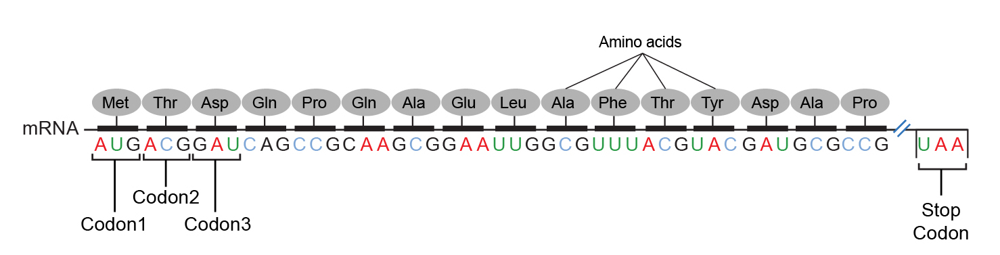

## Bioinformatics

Bioinformatics is a recent scientific field that emerged in the 1990s at the interface between biology, computer science, mathematics and physics. It is defined as the application of tools of computation and analysis to the capture and interpretation of biological data. It involves tracking, analyzing and storing biological data to help solve big health challenges.

One of the most common applications of bioinformatics, for instance, is in the "omics" field like genomics, which seeks to study, sequence and map the genetic information of organisms ranging from human beings to bacteria.

Bioinformatics deploys innovative uses of data science, statistics and quantitative methods to the areas of medicine and biology in order to solve big human and public health challenges.

Bioinformatics is essential for management of data in modern biology and medicine. It's a pretty recent branch of biology that encompasses the use of algebraic, analytic, and computing approaches to the processing and interpretation of biological information.

Large commercial enterprises such as pharmaceutical companies employ bioinformaticians to perform and maintain the large scale and complicated bioinformatic needs of these industries. A fundamental activity is sequence analysis of DNA and proteins using various programs and databases available on the world wide web.
With an ever-increasing need for constant input from bioinformatic experts, most biomedical laboratories may soon have their own in-house bioinformatician. The individual researcher, beyond a basic acquisition and analysis of simple data, would certainly need external bioinformatic advice for any complex analysis.

## An evolving discipline

The escalating amount of data from the genome projects has necessitated computer databases that feature rapid assimilation, usable formats and algorithm software programs for efficient management of biological data.

Between the 1980s and early 2000s, huge strides were made in the Human Genome Project and other genome mapping projects. As these projects sprung up around the world, researchers started to grapple with the massive amounts of valuable and sensitive data -- for example, DNA sequencing data -- that needed to be stored, processed, securely shared, and built upon as a medical research community. Advanced computational tools and processes like programming, massive secure databases and algorithms were required to harness the power of the biological data.

Today, bioinformatics is integral to the advancement of biomedical research, effective medicine, healthcare, and public health worldwide. Bioinformatics has the potential to revolutionize our core understanding of biological processes, with endless applications to improve quality of life.

In many ways, we're living in a golden age of medicine. Data science methods, big data predictive analytics, and machine learning algorithms are enabling new breakthroughs in health prediction. Equipped with advanced tools, doctors and their medical teams are learning how to identify patterns and anomalies in data, detecting diseases much earlier than was previously possible. These include lung and breast cancer, autoimmune diseases, liver diseases, Zika virus, and more. In many cases, the earlier these diseases are identified, the faster they can be treated and the better the patient's chance of defeating the illness.

Digital information streaming from innumerable sensors, instruments and simulations is outrunning our capacity to accumulate, organize and analyze it for making healthcare decisions. We need fundamental progress in biomedical informatics to exploit the full wealth of knowledge embedded in genomic, proteomic, genetic, epidemiological, and clinical data and gain a full return on our substantial investments in health information technology. In aggregate, this deluge of metagenomic and biological data -- commonly known as "big data" -- is far too large and expansive to process, analyze, share or store via traditional methods or software programs. Advanced computational tools like machine learning algorithms and secure storage of sensitive big data is required to fully realize the potential of this treasure trove of information.

With significant advances in DNA and RNA sequencing, popularized by consumer DNA genetic testing, we're on the precipice of a new consumer healthcare experience. In the not too distant future, doctors will practice **precision medicine** , defined as the tailored treatment of each individual's disease based on the disease's molecular profile.

Bioinformatics is an evolving discipline, and expert bioinformaticians now use complex software programs for retrieving, sorting out, analysing, predicting, and storing DNA and protein sequence data.

### Open-source

Many free and open-source software tools have existed and continued to grow since the 1980s.The combination of a continued need for new algorithms for the analysis of emerging types of biological readouts, the potential for innovative in silico experiments, and freely available open code bases have created opportunities for research groups to contribute to both bioinformatics regardless of funding.

Open-source bioinformatics software includes Bioconductor, BioPerl, Biopython, BioJava, BioJS, BioRuby, Bioclipse, EMBOSS, .NET Bio, Orange with its bioinformatics add-on, Apache Taverna, UGENE and GenoCAD.

### A bit of history

Since the bacteriophage Phage Φ-X174 was sequenced in 1977,[24] the DNA sequences of thousands of organisms have been decoded and stored in databases.
With the growing amount of data, it long ago became impractical to analyze DNA sequences manually.

### Sequences storage

Databases are essential for bioinformatics research and applications. Databases exist for many different information types, including DNA and protein sequences, molecular structures, phenotypes and biodiversity. Databases can contain both empirical data (obtained directly from experiments) and predicted data (obtained from analysis of existing data). They may be specific to a particular organism, pathway or molecule of interest. Alternatively, they can incorporate data compiled from multiple other databases.

Before sequences can be analyzed, they are obtained from a data storage bank, such as GenBank.

### Evolutionary biology

Evolutionary biology is the study of the origin and descent of species, as well as their change over time. Informatics has assisted evolutionary biologists by enabling researchers to trace the evolution of a large number of organisms by measuring changes in their DNA, rather than through physical taxonomy or physiological observations alone,

### Genome analysis for cancer understanding

Permanent changes in DNA sequence called mutations can be inherited or acquired and can affect one or multiple genes. A genetic disease is a disease caused by an inherited change in an organism’s DNA sequence. Scientists now believe that most disorders have a genetic component.

In healthcare, clinical bioinformaticians work within a wider team including clinical geneticists and laboratory scientists to help provide answers for patients diagnosed with rare disease or cancer.

The main role of the clinical bioinformatician is to create and use computer programs and software tools to filter large quantities of genomic data – usually gathered through next-generation sequencing methods, such as whole genome sequencing (WGS) or whole exome sequencing. In doing so, bioinformaticians aim to find meaning in this overwhelming amount of information and provide clinically actionable solutions to help patients.

Bioinformatics is essential for understanding cancer genomics and shaping future cancer therapies. Bioinformatics approaches can transform vast quantities of biological data into comprehensive models, providing insights into cancer and the genotype-phenotype relationships crucial for identifying cancer-driving alterations and therapeutic targets.

## Into DNA

Heredity is the transmission of genes and traits from one generation to the next.

Genetic code refers to the instructions contained in a gene that tell a cell how to make a specific protein. Each gene’s code uses the four nucleotide bases of DNA: adenine (A), cytosine (C), guanine (G) and thymine (T) — in various ways to spell out three-letter “codons” that specify which amino acid is needed at each position within a protein.

Deoxyribonucleic acid (abbreviated DNA) is the molecule that carries genetic information for the development and functioning of an organism. DNA is made of two linked strands that wind around each other to resemble a twisted ladder — a shape known as a double helix.

We are all far more alike than we are different? In fact, the DNA from any two people is 99.9% identical. The differing 0.1% contains variations that influence our uniqueness, which when combined with our environmental and social contexts give us our abilities, our health, our behavior.

### Amino Acids

Amino acis are the building blocks of proteins. The primary structure can be easily determined from the sequence of codons on the DNA gene that codes for it.
There are 20 different amino acids. A protein consists of one or more chains of amino acids. Some amino acids can be synthesized in the body, but others (essential amino acids) cannot and must be obtained from a person’s diet.

A peptide is a short chain of amino acids (typically 2 to 50) linked by chemical bonds (called peptide bonds). A longer chain of linked amino acids (51 or more) is a polypeptide.

### Proteins

Proteins are large, complex molecules that play many important roles in the body. They are critical to most of the work done by cells and are required for the structure, function and regulation of the body’s tissues and organs. A protein is made up of one or more long, folded chains of amino acids (each called a polypeptide), whose sequences are determined by the DNA sequence of the protein-encoding gene.
